# LEG Documentation

Welcome to the LEG documentation! This guide will help you find the information you need based on your role and interests.

## Documentation Structure

```mermaid
graph TB
    subgraph "Getting Started"
        GS[Installation Guide]
        FT[First Tree]
        ID[Importing Data]
    end
    
    subgraph "User Documentation"
        UG[User Guide]
        CT[Creating Trees]
        MI[Managing Individuals]
        CO[Collaboration]
        PS[Privacy Settings]
    end
    
    subgraph "Developer Documentation"
        DS[Developer Setup]
        AO[Architecture Overview]
        CC[Clean Code Guidelines]
        CG[Commit Guidelines]
        AR[API Reference]
    end
    
    subgraph "Technical Documentation"
        GC[GEDCOM Compliance]
        TI[Tools Integration]
        TV[Tree View]
        UX[UI/UX Design]
        SN[Sidebar Navigation]
        PD[Project Dictionary]
    end
    
    subgraph "Project Planning"
        PR[Product Roadmap]
        FS[Feature Specifications]
        RE[Requirements]
    end
    
    GS --> UG
    FT --> CT
    ID --> MI
    UG --> CO
    CT --> PS
    DS --> AO
    AO --> CC
    CC --> CG
    CG --> AR
    GC --> TI
    TI --> TV
    TV --> UX
    UX --> SN
    SN --> PD
    PR --> FS
    FS --> RE
```

## 👋 New to LEG?

Start here:
- [Getting Started Guide](getting-started/installation.md) → Learn how to set up and run LEG
- [Your First Tree](getting-started/first-tree.md) → Create your first family tree
- [Importing Data](getting-started/importing-data.md) → Import your existing genealogy data

## 👥 Using LEG?

Jump to:
- [User Guide](user-guide/README.md) → Complete guide to using LEG
- [Creating Trees](user-guide/creating-trees.md) → Learn about tree management
- [Managing Individuals](user-guide/managing-individuals.md) → Add and edit family members
- [Collaboration](user-guide/collaboration.md) → Work with others on your research
- [Privacy Settings](user-guide/privacy-settings.md) → Control who sees your data

## 🔧 Contributing?

Begin with:
- [Developer Setup](developer/README.md) → Set up your development environment
- [Architecture Overview](developer/architecture.md) → Understand LEG's architecture
- [Clean Code Guidelines](developer/clean-code.md) → Follow our coding standards
- [Commit Guidelines](developer/commit-guidelines.md) → Learn our commit message format

## 📋 Planning Features?

Review:
- [Product Roadmap](product/roadmap.md) → See what's coming next
- [Feature Specifications](product/features.md) → Detailed feature documentation
- [Requirements](product/requirements.md) → Technical and functional requirements

## 🔍 Technical Details

Explore:
- [GEDCOM Compliance](developer/gedcom-compliance.md) → GEDCOM 5.5.5 support
- [Tools Integration](developer/tools-integration.md) → Monitoring and profiling
- [Tree View](developer/tree-view.md) → Family tree visualization
- [UI/UX Design](developer/ui-ux.md) → Interface design principles
- [Sidebar Navigation](developer/sidebar-navigation.md) → Navigation structure
- [Project Dictionary](developer/dictionary.md) → Terms and conventions

## 📚 Additional Resources

- [API Reference](developer/api-reference.md) → Complete API documentation
- [Troubleshooting Guide](user-guide/troubleshooting.md) → Common issues and solutions
- [Best Practices](developer/best-practices.md) → Development guidelines
- [Security Guide](developer/security.md) → Security considerations

## 🚀 Current Implementation Status

### ✅ Implemented Features
- **Authentication & Authorization**: Complete user management with roles
- **Tree Management**: Create, edit, import, export trees with GEDCOM support
- **Individual Management**: Full CRUD operations with relationship management
- **Timeline Events**: Create and manage timeline events with public sharing
- **Neo4j Integration**: Advanced relationship queries and graph operations
- **Import Optimization**: Dual import methods with performance tracking
- **Admin Dashboard**: Activity logs, import metrics, user management
- **Search & Filtering**: Advanced search capabilities
- **Media Management**: File uploads and media organization
- **Community Features**: Groups, collaboration tools
- **Reporting**: Timeline reports and export functionality

### 🔄 In Progress
- **Advanced Tree Visualization**: Enhanced D3.js implementations
- **Performance Optimization**: Ongoing improvements to import and query performance
- **API Enhancement**: Expanding REST API capabilities

### 📋 Planned Features
- **DNA Integration**: Link DNA results to family trees
- **Advanced Privacy Controls**: Granular privacy settings
- **Multimedia Storytelling**: Enhanced media integration
- **Geographic Mapping**: Migration patterns and historical maps
- **Internationalization**: Multi-language support

---

*This documentation is regularly updated. Last updated: January 2025* 