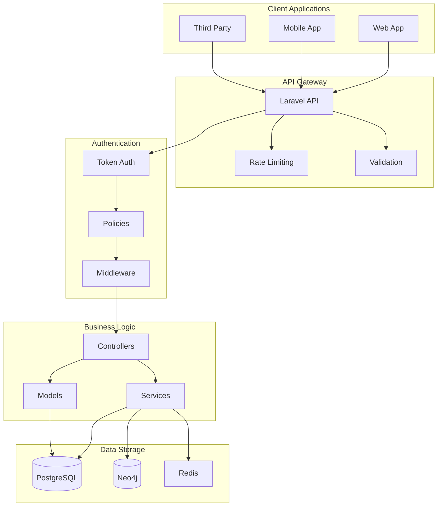
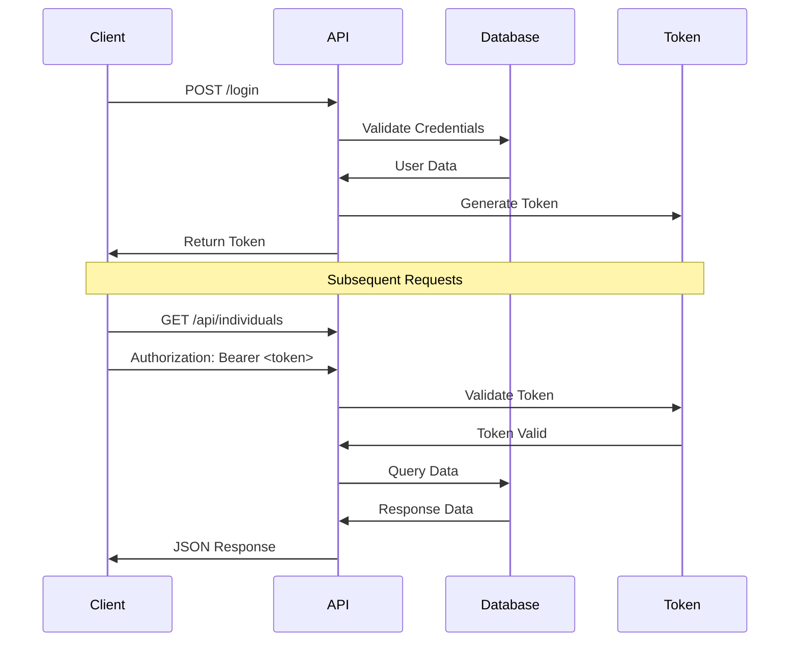
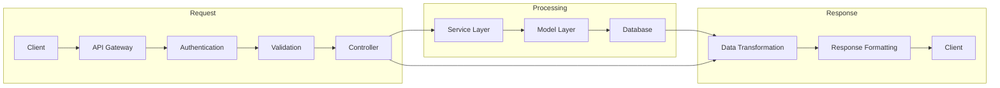

# LEG API Documentation

## Overview

The LEG API provides programmatic access to the family tree data and functionality. This documentation covers all available endpoints, authentication methods, and usage examples.

## API Architecture



## Authentication Flow



## Base URL

```
http://localhost/api
```

## Authentication

### Bearer Token Authentication

All API requests require authentication using a Bearer token. Include the token in the Authorization header:

```http
Authorization: Bearer <your_token>
```

To obtain a token:

1. Login through the web interface
2. Navigate to your profile settings
3. Generate an API token

## API Security

### Rate Limiting
- 60 requests per minute per authenticated user
- 30 requests per minute per IP address for unauthenticated requests
- Implement exponential backoff for retries
- Monitor your API usage

### Request Validation
- All requests must include proper headers
- Request bodies must be valid JSON
- Required fields must be present
- Data types must match specifications

### Error Handling
- Use appropriate HTTP status codes
- Return detailed error messages
- Log all API errors
- Implement proper error responses

## Request/Response Pattern



## Endpoints

### Individuals

#### List Individuals

```http
GET /api/individuals
```

Query Parameters:
- `page` (optional): Page number for pagination
- `per_page` (optional): Items per page (default: 15)
- `search` (optional): Search term for filtering

Response:
```json
{
    "data": [
        {
            "id": 1,
            "first_name": "John",
            "last_name": "Doe",
            "birth_date": "1950-01-01",
            "death_date": null,
            "sex": "M",
            "created_at": "2025-03-15T10:00:00Z",
            "updated_at": "2025-03-15T10:00:00Z"
        }
    ],
    "meta": {
        "current_page": 1,
        "per_page": 15,
        "total": 1
    }
}
```

#### Get Individual

```http
GET /api/individuals/{id}
```

Response:
```json
{
    "data": {
        "id": 1,
        "first_name": "John",
        "last_name": "Doe",
        "birth_date": "1950-01-01",
        "death_date": null,
        "sex": "M",
        "created_at": "2025-03-15T10:00:00Z",
        "updated_at": "2025-03-15T10:00:00Z"
    }
}
```

#### Create Individual

```http
POST /api/individuals
```

Request Body:
```json
{
    "first_name": "John",
    "last_name": "Doe",
    "birth_date": "1950-01-01",
    "death_date": null,
    "sex": "M"
}
```

Response:
```json
{
    "data": {
        "id": 1,
        "first_name": "John",
        "last_name": "Doe",
        "birth_date": "1950-01-01",
        "death_date": null,
        "sex": "M",
        "created_at": "2025-03-15T10:00:00Z",
        "updated_at": "2025-03-15T10:00:00Z"
    }
}
```

#### Update Individual

```http
PUT /api/individuals/{id}
```

Request Body:
```json
{
    "first_name": "John",
    "last_name": "Doe",
    "birth_date": "1950-01-01",
    "death_date": null,
    "sex": "M"
}
```

Response:
```json
{
    "data": {
        "id": 1,
        "first_name": "John",
        "last_name": "Doe",
        "birth_date": "1950-01-01",
        "death_date": null,
        "sex": "M",
        "created_at": "2025-03-15T10:00:00Z",
        "updated_at": "2025-03-15T10:00:00Z"
    }
}
```

#### Delete Individual

```http
DELETE /api/individuals/{id}
```

Response:
```json
{
    "message": "Individual deleted successfully"
}
```

### Trees

#### List Trees

```http
GET /api/trees
```

Query Parameters:
- `page` (optional): Page number for pagination
- `per_page` (optional): Items per page (default: 15)
- `search` (optional): Search term for filtering

Response:
```json
{
    "data": [
        {
            "id": 1,
            "name": "Smith Family Tree",
            "description": "Family tree of the Smith family",
            "created_at": "2025-03-15T10:00:00Z",
            "updated_at": "2025-03-15T10:00:00Z"
        }
    ],
    "meta": {
        "current_page": 1,
        "per_page": 15,
        "total": 1
    }
}
```

#### Get Tree

```http
GET /api/trees/{id}
```

Response:
```json
{
    "data": {
        "id": 1,
        "name": "Smith Family Tree",
        "description": "Family tree of the Smith family",
        "created_at": "2025-03-15T10:00:00Z",
        "updated_at": "2025-03-15T10:00:00Z"
    }
}
```

#### Create Tree

```http
POST /api/trees
```

Request Body:
```json
{
    "name": "Smith Family Tree",
    "description": "Family tree of the Smith family"
}
```

Response:
```json
{
    "data": {
        "id": 1,
        "name": "Smith Family Tree",
        "description": "Family tree of the Smith family",
        "created_at": "2025-03-15T10:00:00Z",
        "updated_at": "2025-03-15T10:00:00Z"
    }
}
```

#### Update Tree

```http
PUT /api/trees/{id}
```

Request Body:
```json
{
    "name": "Smith Family Tree",
    "description": "Updated description"
}
```

Response:
```json
{
    "data": {
        "id": 1,
        "name": "Smith Family Tree",
        "description": "Updated description",
        "created_at": "2025-03-15T10:00:00Z",
        "updated_at": "2025-03-15T10:00:00Z"
    }
}
```

#### Delete Tree

```http
DELETE /api/trees/{id}
```

Response:
```json
{
    "message": "Tree deleted successfully"
}
```

### Tree Nodes

#### List Tree Nodes

```http
GET /api/trees/{tree_id}/nodes
```

Response:
```json
{
    "data": [
        {
            "id": 1,
            "tree_id": 1,
            "individual_id": 1,
            "parent_id": null,
            "created_at": "2025-03-15T10:00:00Z",
            "updated_at": "2025-03-15T10:00:00Z"
        }
    ]
}
```

#### Add Node to Tree

```http
POST /api/trees/{tree_id}/nodes
```

Request Body:
```json
{
    "individual_id": 1,
    "parent_id": null
}
```

Response:
```json
{
    "data": {
        "id": 1,
        "tree_id": 1,
        "individual_id": 1,
        "parent_id": null,
        "created_at": "2025-03-15T10:00:00Z",
        "updated_at": "2025-03-15T10:00:00Z"
    }
}
```

#### Update Node

```http
PUT /api/trees/{tree_id}/nodes/{node_id}
```

Request Body:
```json
{
    "parent_id": 2
}
```

Response:
```json
{
    "data": {
        "id": 1,
        "tree_id": 1,
        "individual_id": 1,
        "parent_id": 2,
        "created_at": "2025-03-15T10:00:00Z",
        "updated_at": "2025-03-15T10:00:00Z"
    }
}
```

#### Delete Node

```http
DELETE /api/trees/{tree_id}/nodes/{node_id}
```

Response:
```json
{
    "message": "Node deleted successfully"
}
```

## Error Responses

All endpoints return standard HTTP status codes and error messages in the following format:

```json
{
    "error": {
        "message": "Error message",
        "code": "ERROR_CODE"
    }
}
```

Common error codes:
- `401`: Unauthorized
- `403`: Forbidden
- `404`: Not Found
- `422`: Validation Error
- `429`: Too Many Requests
- `500`: Server Error

## Usage Examples

### JavaScript Example

```javascript
const API_URL = 'http://localhost/api';
const TOKEN = 'your_token';

async function fetchIndividuals() {
    try {
        const response = await fetch(`${API_URL}/individuals`, {
            headers: {
                'Authorization': `Bearer ${TOKEN}`,
                'Accept': 'application/json'
            }
        });
        
        if (!response.ok) {
            throw new Error('API request failed');
        }
        
        const data = await response.json();
        return data;
    } catch (error) {
        console.error('Error:', error);
        throw error;
    }
}
```

### PHP Example

```php
$apiUrl = 'http://localhost/api';
$token = 'your_token';

$ch = curl_init();
curl_setopt($ch, CURLOPT_URL, $apiUrl . '/individuals');
curl_setopt($ch, CURLOPT_RETURNTRANSFER, true);
curl_setopt($ch, CURLOPT_HTTPHEADER, [
    'Authorization: Bearer ' . $token,
    'Accept: application/json'
]);

$response = curl_exec($ch);
$httpCode = curl_getinfo($ch, CURLINFO_HTTP_CODE);
curl_close($ch);

if ($httpCode === 200) {
    $data = json_decode($response, true);
    // Process data
} else {
    // Handle error
}
```

## Support

For API support or to report issues:
1. Check the [troubleshooting guide](../user-guide/troubleshooting.md)
2. Create an issue in the project repository
3. Contact the development team

---

*Last updated: June 2025* 