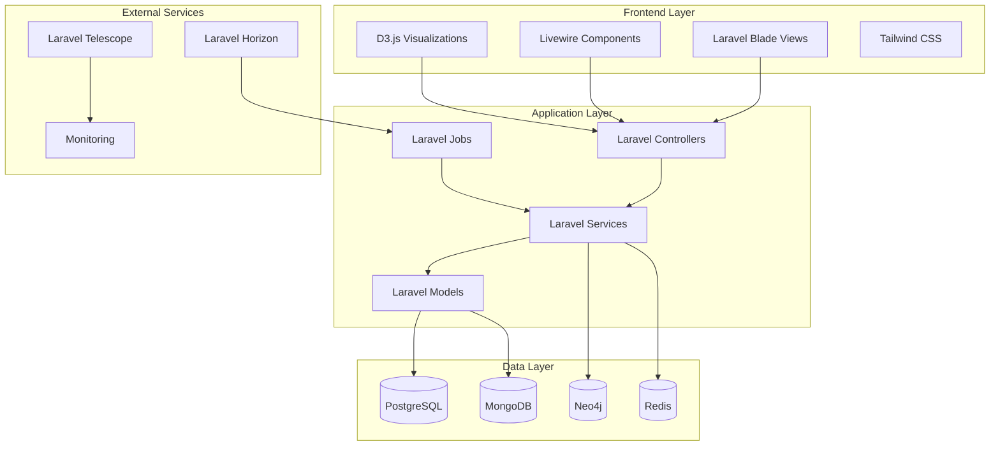

# Architecture Overview

## System Architecture

LEG (Laravel Enhanced Genealogy) is built on a modern, scalable architecture that combines multiple databases for optimal performance and data integrity.



## Technology Stack

### Backend Framework
- **Laravel 12.x**: Modern PHP framework with robust features
- **PHP 8.4+**: Latest PHP version with enhanced performance
- **Composer**: Dependency management

### Database Architecture
- **PostgreSQL**: Primary relational database for core data
- **MongoDB**: Document storage for flexible data structures
- **Neo4j**: Graph database for relationship management
- **Redis**: Caching and session management

### Frontend Technologies
- **Laravel Blade**: Server-side templating
- **Livewire 3.x**: Dynamic frontend components
- **Tailwind CSS 4.x**: Utility-first CSS framework
- **D3.js**: Data visualization library
- **Vite**: Modern build tool

### Development Tools
- **Laravel Pint**: Code styling
- **PHPStan**: Static analysis
- **Rector**: Automated refactoring
- **PHPUnit**: Testing framework
- **Laravel Telescope**: Debugging and monitoring

## Core Components

### Models

#### Primary Models
```php
// Core genealogy models
Individual::class          // Family members
Tree::class               // Family trees
Family::class             // Family units
Event::class              // Life events
TimelineEvent::class      // Timeline entries

// Supporting models
Media::class              // Photos and documents
Source::class             // Research sources
Story::class              // Family stories
Group::class              // Community groups

// System models
User::class               // User accounts
Role::class               // User roles
ActivityLog::class        // System activity
ImportProgress::class     // Import tracking
```

#### Database Relationships
```php
// Individual relationships
Individual -> Tree (belongsTo)
Individual -> Family (belongsToMany)
Individual -> Event (hasMany)
Individual -> Media (hasMany)

// Tree relationships
Tree -> Individual (hasMany)
Tree -> User (belongsTo)
Tree -> Group (belongsToMany)

// Timeline relationships
TimelineEvent -> Individual (belongsTo)
TimelineEvent -> User (belongsTo)
```

### Services

#### Core Services
```php
// Import services
GedcomService::class              // Basic GEDCOM processing
GedcomMultiDatabaseService::class // Multi-database import
GedcomImportOptimizer::class      // Optimized import

// Relationship services
Neo4jIndividualService::class     // Graph relationship management

// Performance services
ImportPerformanceTracker::class    // Import metrics
MonitoringService::class          // System monitoring
CacheService::class               // Caching management
SecurityEnhancer::class          // Security features
```

#### Service Responsibilities
- **GedcomService**: Basic GEDCOM file parsing and validation
- **GedcomMultiDatabaseService**: ACID-compliant multi-database imports
- **GedcomImportOptimizer**: High-performance parallel processing
- **Neo4jIndividualService**: Advanced relationship queries and graph operations
- **ImportPerformanceTracker**: Real-time import metrics collection
- **MonitoringService**: System health monitoring and alerting

### Controllers

#### Web Controllers
```php
// Core functionality
TreeController::class             // Tree management
IndividualController::class       // Individual management
TimelineEventController::class    // Timeline management
Neo4jRelationshipController::class // Relationship management

// Supporting functionality
SearchController::class           // Search and filtering
MediaController::class            // Media management
EventController::class            // Event management
GroupController::class            // Community features

// Admin functionality
AdminController::class            // Admin dashboard
ActivityLogController::class      // Activity monitoring
ImportProgressController::class   // Import tracking
```

#### API Controllers
```php
// REST API
IndividualController::class       // Individual CRUD operations
ImportMetricsController::class    // Import performance metrics
```

### Jobs

#### Background Processing
```php
ImportGedcomJob::class           // GEDCOM import processing
```

#### Job Features
- **Queue Management**: Laravel Horizon for job processing
- **Error Handling**: Comprehensive error handling and retry logic
- **Performance Tracking**: Real-time metrics collection
- **User Notifications**: Email and in-app notifications

## Database Architecture

### Multi-Database Strategy

#### PostgreSQL (Primary)
```sql
-- Core genealogy data
individuals (id, first_name, last_name, birth_date, death_date, sex, tree_id)
trees (id, name, description, user_id, individual_count, generation_count)
families (id, husband_id, wife_id, marriage_date, divorce_date)
events (id, individual_id, event_type, event_date, location, description)

-- System data
users (id, name, email, password, role_id)
roles (id, name, permissions)
activity_logs (id, user_id, action, details, created_at)
import_progress (id, tree_id, user_id, status, progress, metrics)
```

#### MongoDB (Document Storage)
```javascript
// Flexible document storage
{
  "_id": ObjectId,
  "type": "individual_details",
  "individual_id": 123,
  "data": {
    "biography": "Detailed life story...",
    "notes": "Research notes...",
    "custom_fields": {
      "occupation": "Engineer",
      "education": "PhD"
    }
  }
}
```

#### Neo4j (Graph Relationships)
```cypher
// Graph relationships
CREATE (p1:Individual {id: 1, name: "John Doe"})
CREATE (p2:Individual {id: 2, name: "Jane Doe"})
CREATE (p1)-[:PARENT_OF]->(p2)
CREATE (p1)-[:SPOUSE_OF]->(p2)
```

#### Redis (Caching)
```php
// Cache keys
'individual:123' => Individual data
'tree:456:members' => Tree member list
'search:query_hash' => Search results
'import:metrics' => Performance metrics
```

### Data Flow

#### Import Process
1. **File Upload**: GEDCOM file uploaded via web interface
2. **Job Creation**: Import job queued with method selection
3. **Processing**: Service processes file based on selected method
4. **Data Distribution**: Data distributed across appropriate databases
5. **Metrics Collection**: Performance metrics tracked throughout
6. **User Notification**: Completion notification sent to user

#### Query Process
1. **Request**: User requests data via web interface
2. **Cache Check**: Redis checked for cached data
3. **Database Query**: Appropriate database queried
4. **Data Aggregation**: Data combined from multiple sources
5. **Response**: Formatted response sent to user

## Security Architecture

### Authentication & Authorization
- **Laravel Sanctum**: API authentication
- **Role-based Access**: Admin and user roles
- **Middleware**: Route protection and validation
- **CSRF Protection**: Cross-site request forgery protection

### Data Protection
- **Input Validation**: Comprehensive request validation
- **SQL Injection Prevention**: Parameterized queries
- **XSS Protection**: Output sanitization
- **File Upload Security**: Secure file handling

### Privacy Controls
- **User Permissions**: Granular access controls
- **Data Encryption**: Sensitive data encryption
- **Audit Logging**: Comprehensive activity logging
- **GDPR Compliance**: Data protection compliance

## Performance Optimization

### Caching Strategy
- **Redis Caching**: Session and data caching
- **Query Caching**: Database query results
- **Page Caching**: Static page content
- **API Caching**: API response caching

### Database Optimization
- **Indexing**: Strategic database indexing
- **Query Optimization**: Optimized database queries
- **Connection Pooling**: Database connection management
- **Read Replicas**: Database read scaling

### Application Optimization
- **Lazy Loading**: Efficient data loading
- **Eager Loading**: Relationship optimization
- **Queue Processing**: Background job processing
- **Asset Optimization**: Frontend asset optimization

## Monitoring & Observability

### Application Monitoring
- **Laravel Telescope**: Debugging and monitoring
- **Performance Metrics**: Real-time performance tracking
- **Error Tracking**: Comprehensive error logging
- **Health Checks**: System health monitoring

### Infrastructure Monitoring
- **Database Monitoring**: Database performance tracking
- **Queue Monitoring**: Job queue monitoring
- **Cache Monitoring**: Redis cache monitoring
- **Server Monitoring**: Server resource monitoring

### Alerting
- **Performance Alerts**: Performance threshold alerts
- **Error Alerts**: Error rate alerts
- **Resource Alerts**: Resource usage alerts
- **Security Alerts**: Security incident alerts

## Deployment Architecture

### Containerization
```yaml
# Docker services
app: Laravel application
nginx: Web server
postgresql: Primary database
mongodb: Document database
neo4j: Graph database
redis: Cache and sessions
```

### Environment Configuration
- **Development**: Local development environment
- **Staging**: Pre-production testing environment
- **Production**: Live application environment

### Scaling Strategy
- **Horizontal Scaling**: Multiple application instances
- **Database Scaling**: Read replicas and sharding
- **Cache Scaling**: Redis cluster configuration
- **CDN Integration**: Content delivery network

## Development Workflow

### Code Quality
- **Static Analysis**: PHPStan for code analysis
- **Code Styling**: Laravel Pint for code formatting
- **Automated Refactoring**: Rector for code improvements
- **Testing**: Comprehensive test coverage

### Version Control
- **Git Workflow**: Feature branch workflow
- **Code Review**: Pull request reviews
- **Continuous Integration**: Automated testing
- **Deployment**: Automated deployment pipeline

### Documentation
- **API Documentation**: Comprehensive API reference
- **Code Documentation**: Inline code documentation
- **Architecture Documentation**: System architecture docs
- **User Documentation**: User guides and tutorials 