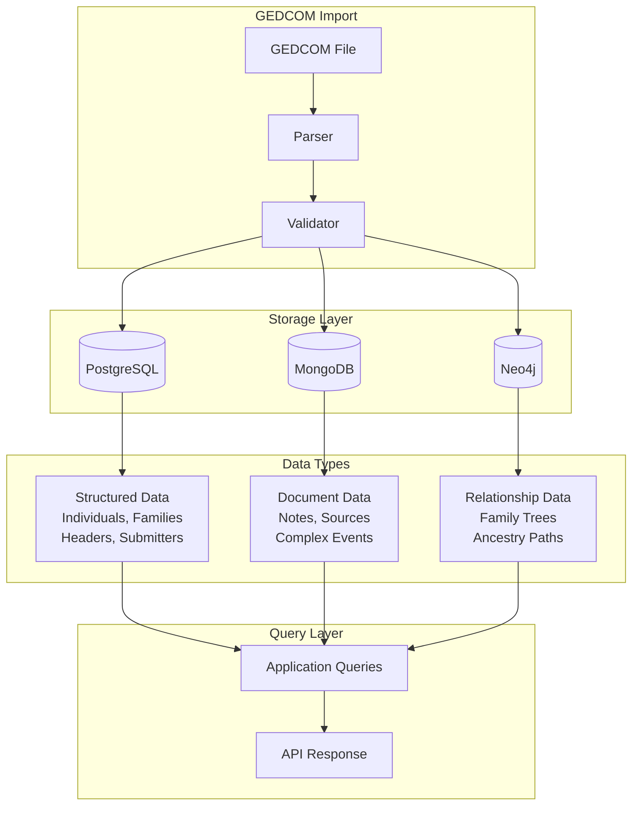
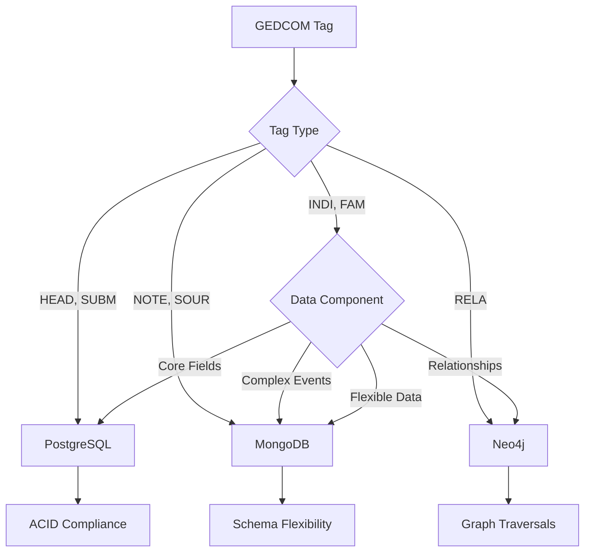
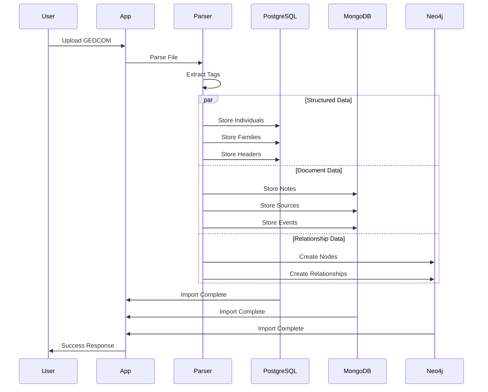

# GEDCOM 7.0 Storage Strategy

## Overview

This document outlines the optimal storage strategy for GEDCOM 7.0 data across our multi-database architecture using PostgreSQL, MongoDB, and Neo4j. The strategy is designed to leverage each database's strengths for specific data types and query patterns.

## Multi-Database Architecture



## Database Selection Flow



## Data Flow Architecture



## Database Architecture

### PostgreSQL (Primary Relational Data)
- **Purpose**: Structured, transactional data with ACID compliance
- **Use Cases**: Core entities, user management, audit trails, metadata
- **Strengths**: Complex queries, joins, constraints, transactions

### MongoDB (Document Storage)
- **Purpose**: Flexible document storage for unstructured/semi-structured data
- **Use Cases**: Notes, sources, multimedia metadata, complex event data
- **Strengths**: Schema flexibility, nested documents, text search

### Neo4j (Graph Relationships)
- **Purpose**: Relationship-centric data and complex genealogical queries
- **Use Cases**: Family relationships, ancestry/descendant paths, social networks
- **Strengths**: Graph traversals, path finding, relationship analytics

## GEDCOM 7.0 Tag Storage Mapping

### 1. HEAD (Header) - PostgreSQL
```sql
-- Store in dedicated header table
CREATE TABLE gedcom_headers (
    id SERIAL PRIMARY KEY,
    tree_id INTEGER REFERENCES trees(id),
    submitter_ref VARCHAR(255),
    destination VARCHAR(255),
    transmission_date TIMESTAMP,
    transmission_time TIME,
    gedcom_version VARCHAR(10),
    gedcom_form VARCHAR(50),
    character_set VARCHAR(50),
    character_set_version VARCHAR(20),
    language VARCHAR(10),
    place_hierarchy TEXT,
    place_format VARCHAR(100),
    header_notes TEXT,
    created_at TIMESTAMP DEFAULT NOW()
);
```

**Rationale**: Header data is structured, rarely changes, and requires ACID compliance for data integrity.

### 2. SUBM (Submitter) - PostgreSQL
```sql
-- Store in submitters table
CREATE TABLE submitters (
    id SERIAL PRIMARY KEY,
    tree_id INTEGER REFERENCES trees(id),
    name VARCHAR(255) NOT NULL,
    address_line1 VARCHAR(255),
    address_line2 VARCHAR(255),
    address_line3 VARCHAR(255),
    city VARCHAR(100),
    state VARCHAR(100),
    postal_code VARCHAR(20),
    country VARCHAR(100),
    phone VARCHAR(50),
    email VARCHAR(255),
    website VARCHAR(255),
    language_preference VARCHAR(10),
    created_at TIMESTAMP DEFAULT NOW()
);
```

**Rationale**: Submitter data is structured contact information requiring referential integrity.

### 3. INDI (Individual) - Hybrid Storage

#### PostgreSQL (Core Individual Data)
```sql
-- Enhanced individuals table
CREATE TABLE individuals (
    id SERIAL PRIMARY KEY,
    tree_id INTEGER REFERENCES trees(id),
    user_id INTEGER REFERENCES users(id),
    gedcom_xref VARCHAR(50) UNIQUE, -- Original GEDCOM reference
    first_name VARCHAR(255) NOT NULL,
    last_name VARCHAR(255) NOT NULL,
    name_prefix VARCHAR(50),
    name_suffix VARCHAR(50),
    nickname VARCHAR(255),
    sex CHAR(1) CHECK (sex IN ('M', 'F', 'U')),
    birth_date DATE,
    death_date DATE,
    birth_place VARCHAR(255),
    death_place VARCHAR(255),
    death_cause TEXT,
    pedigree_type VARCHAR(50), -- From FAMC.PEDI
    created_at TIMESTAMP DEFAULT NOW(),
    updated_at TIMESTAMP DEFAULT NOW()
);

-- Individual addresses (for birth/death events)
CREATE TABLE individual_addresses (
    id SERIAL PRIMARY KEY,
    individual_id INTEGER REFERENCES individuals(id),
    address_type VARCHAR(20), -- 'birth', 'death', 'residence'
    address_line1 VARCHAR(255),
    address_line2 VARCHAR(255),
    address_line3 VARCHAR(255),
    city VARCHAR(100),
    state VARCHAR(100),
    postal_code VARCHAR(20),
    country VARCHAR(100),
    created_at TIMESTAMP DEFAULT NOW()
);
```

#### MongoDB (Flexible Individual Data)
```javascript
// Individual documents collection
{
  "_id": ObjectId,
  "individual_id": 123, // Reference to PostgreSQL
  "tree_id": 1,
  "gedcom_xref": "@I1@",
  "name_components": {
    "given_name": "John",
    "surname": "Doe",
    "prefix": "Dr.",
    "suffix": "Jr.",
    "nickname": "Johnny"
  },
  "events": [
    {
      "type": "BIRT",
      "date": "1980-01-15",
      "place": "New York, NY",
      "address": {
        "line1": "123 Main St",
        "city": "New York",
        "state": "NY"
      },
      "sources": ["@S1@", "@S2@"],
      "notes": ["@N1@"]
    },
    {
      "type": "DEAT",
      "date": "2020-05-20",
      "place": "Los Angeles, CA",
      "cause": "Natural causes"
    }
  ],
  "custom_fields": {
    "occupation": "Engineer",
    "education": "PhD",
    "religion": "Catholic"
  },
  "metadata": {
    "import_source": "GEDCOM",
    "last_updated": ISODate("2024-01-01")
  }
}
```

#### Neo4j (Individual Relationships)
```cypher
// Individual nodes with properties
CREATE (i:Individual {
    id: 123,
    tree_id: 1,
    gedcom_xref: "@I1@",
    first_name: "John",
    last_name: "Doe",
    sex: "M",
    birth_date: "1980-01-15",
    death_date: "2020-05-20"
})

// Family relationships
CREATE (parent:Individual {id: 124})-[:PARENT_OF]->(child:Individual {id: 123})
CREATE (spouse1:Individual {id: 123})-[:SPOUSE_OF]->(spouse2:Individual {id: 125})
CREATE (sibling1:Individual {id: 123})-[:SIBLING_OF]->(sibling2:Individual {id: 126})
```

### 4. FAM (Family) - Hybrid Storage

#### PostgreSQL (Family Core Data)
```sql
-- Families table
CREATE TABLE families (
    id SERIAL PRIMARY KEY,
    tree_id INTEGER REFERENCES trees(id),
    gedcom_xref VARCHAR(50) UNIQUE,
    husband_id INTEGER REFERENCES individuals(id),
    wife_id INTEGER REFERENCES individuals(id),
    marriage_date DATE,
    marriage_place VARCHAR(255),
    marriage_type VARCHAR(50),
    divorce_date DATE,
    divorce_place VARCHAR(255),
    created_at TIMESTAMP DEFAULT NOW()
);

-- Family children relationship table
CREATE TABLE family_children (
    id SERIAL PRIMARY KEY,
    family_id INTEGER REFERENCES families(id),
    child_id INTEGER REFERENCES individuals(id),
    child_order INTEGER,
    created_at TIMESTAMP DEFAULT NOW(),
    UNIQUE(family_id, child_id)
);
```

#### MongoDB (Family Events & Details)
```javascript
// Family documents collection
{
  "_id": ObjectId,
  "family_id": 456, // Reference to PostgreSQL
  "tree_id": 1,
  "gedcom_xref": "@F1@",
  "marriage_event": {
    "date": "1995-06-15",
    "place": "St. Mary's Church, Boston",
    "type": "religious",
    "witnesses": ["@I10@", "@I11@"],
    "sources": ["@S5@"],
    "notes": ["@N3@"]
  },
  "divorce_event": {
    "date": "2010-03-20",
    "place": "Boston Courthouse",
    "case_number": "DIV-2010-001",
    "sources": ["@S6@"]
  },
  "children": [
    {
      "individual_id": 123,
      "gedcom_xref": "@I1@",
      "order": 1
    }
  ],
  "custom_fields": {
    "family_notes": "Important family information",
    "family_photos": ["@O1@", "@O2@"]
  }
}
```

#### Neo4j (Family Relationships)
```cypher
// Family relationship nodes
CREATE (f:Family {
    id: 456,
    tree_id: 1,
    gedcom_xref: "@F1@"
})

// Connect family members
CREATE (husband:Individual {id: 124})-[:HUSBAND_IN]->(f:Family {id: 456})
CREATE (wife:Individual {id: 125})-[:WIFE_IN]->(f:Family {id: 456})
CREATE (child:Individual {id: 123})-[:CHILD_IN]->(f:Family {id: 456})
```

### 5. OBJE (Multimedia Objects) - MongoDB + PostgreSQL

#### PostgreSQL (Media Metadata)
```sql
-- Media table for core metadata
CREATE TABLE media (
    id SERIAL PRIMARY KEY,
    tree_id INTEGER REFERENCES trees(id),
    gedcom_xref VARCHAR(50) UNIQUE,
    title VARCHAR(255),
    file_path VARCHAR(500),
    file_size BIGINT,
    mime_type VARCHAR(100),
    media_type VARCHAR(50),
    created_at TIMESTAMP DEFAULT NOW()
);

-- Media relationships
CREATE TABLE media_relationships (
    id SERIAL PRIMARY KEY,
    media_id INTEGER REFERENCES media(id),
    related_type VARCHAR(20), -- 'individual', 'family', 'source', 'note'
    related_id INTEGER,
    created_at TIMESTAMP DEFAULT NOW()
);
```

#### MongoDB (Media Details)
```javascript
// Media documents collection
{
  "_id": ObjectId,
  "media_id": 789, // Reference to PostgreSQL
  "tree_id": 1,
  "gedcom_xref": "@O1@",
  "file_info": {
    "original_name": "family_photo.jpg",
    "stored_path": "/uploads/2024/01/family_photo_123.jpg",
    "file_size": 2048576,
    "mime_type": "image/jpeg",
    "dimensions": {
      "width": 1920,
      "height": 1080
    },
    "checksum": "sha256:abc123..."
  },
  "metadata": {
    "title": "Family Photo 1995",
    "description": "Family gathering at Christmas",
    "date_taken": "1995-12-25",
    "location": "Boston, MA",
    "photographer": "John Doe",
    "tags": ["family", "christmas", "1995"]
  },
  "relationships": [
    {
      "type": "individual",
      "individual_id": 123,
      "gedcom_xref": "@I1@"
    },
    {
      "type": "family",
      "family_id": 456,
      "gedcom_xref": "@F1@"
    }
  ],
  "processing": {
    "thumbnails_generated": true,
    "ocr_completed": false,
    "face_detection": true,
    "faces_detected": 5
  }
}
```

### 6. NOTE (Notes) - MongoDB

#### MongoDB (Note Documents)
```javascript
// Notes collection
{
  "_id": ObjectId,
  "tree_id": 1,
  "gedcom_xref": "@N1@",
  "content": "This is a note about John Doe's birth...",
  "type": "general", // 'general', 'research', 'citation', 'correction'
  "relationships": [
    {
      "type": "individual",
      "individual_id": 123,
      "gedcom_xref": "@I1@"
    },
    {
      "type": "event",
      "event_type": "BIRT",
      "individual_id": 123
    }
  ],
  "metadata": {
    "created_by": "user@example.com",
    "created_at": ISODate("2024-01-01"),
    "last_modified": ISODate("2024-01-15"),
    "version": 2
  },
  "formatting": {
    "is_html": false,
    "has_links": true,
    "word_count": 150
  }
}
```

### 7. SOUR (Sources) - MongoDB + PostgreSQL

#### PostgreSQL (Source Core Data)
```sql
-- Sources table
CREATE TABLE sources (
    id SERIAL PRIMARY KEY,
    tree_id INTEGER REFERENCES trees(id),
    gedcom_xref VARCHAR(50) UNIQUE,
    title VARCHAR(500) NOT NULL,
    author VARCHAR(255),
    publication VARCHAR(500),
    repository_id INTEGER REFERENCES repositories(id),
    call_number VARCHAR(255),
    data_quality INTEGER CHECK (data_quality BETWEEN 0 AND 4),
    created_at TIMESTAMP DEFAULT NOW()
);

-- Repositories table
CREATE TABLE repositories (
    id SERIAL PRIMARY KEY,
    tree_id INTEGER REFERENCES trees(id),
    name VARCHAR(255) NOT NULL,
    address_line1 VARCHAR(255),
    address_line2 VARCHAR(255),
    city VARCHAR(100),
    state VARCHAR(100),
    postal_code VARCHAR(20),
    country VARCHAR(100),
    phone VARCHAR(50),
    email VARCHAR(255),
    website VARCHAR(255),
    created_at TIMESTAMP DEFAULT NOW()
);
```

#### MongoDB (Source Details)
```javascript
// Sources collection
{
  "_id": ObjectId,
  "source_id": 101, // Reference to PostgreSQL
  "tree_id": 1,
  "gedcom_xref": "@S1@",
  "details": {
    "title": "Birth Certificate of John Doe",
    "author": "City of Boston",
    "publication": "Vital Records Office",
    "repository": {
      "name": "Boston City Archives",
      "address": "123 Archive St, Boston, MA",
      "phone": "617-555-0123"
    },
    "call_number": "BC-1980-001"
  },
  "source_data": {
    "entry_date": "1980-01-20",
    "text": "Original text from the source document...",
    "transcription": "Transcribed version of the source...",
    "images": ["@O3@", "@O4@"]
  },
  "citations": [
    {
      "type": "individual",
      "individual_id": 123,
      "gedcom_xref": "@I1@",
      "page": "p. 15",
      "quality": 3,
      "notes": ["@N5@"]
    }
  ],
  "metadata": {
    "source_type": "vital_record",
    "record_type": "birth",
    "jurisdiction": "Boston, MA",
    "archive_url": "https://archive.org/...",
    "last_verified": ISODate("2024-01-01")
  }
}
```

### 8. Event Tags - MongoDB + Neo4j

#### MongoDB (Event Documents)
```javascript
// Events collection
{
  "_id": ObjectId,
  "tree_id": 1,
  "individual_id": 123, // Reference to PostgreSQL
  "family_id": 456, // For family events
  "event_type": "BAPM", // Baptism
  "event_data": {
    "date": "1980-02-15",
    "place": "St. Mary's Church, Boston",
    "address": {
      "line1": "456 Church St",
      "city": "Boston",
      "state": "MA"
    },
    "officiant": "Father Smith",
    "witnesses": ["@I10@", "@I11@"],
    "church": "St. Mary's Catholic Church"
  },
  "sources": ["@S1@", "@S2@"],
  "notes": ["@N1@", "@N2@"],
  "media": ["@O1@"],
  "metadata": {
    "certainty": "high",
    "verification_status": "verified",
    "last_updated": ISODate("2024-01-01")
  }
}
```

#### Neo4j (Event Relationships)
```cypher
// Event nodes with relationships
CREATE (e:Event {
    id: 789,
    tree_id: 1,
    event_type: "BAPM",
    date: "1980-02-15",
    place: "St. Mary's Church, Boston"
})

// Connect events to individuals
CREATE (i:Individual {id: 123})-[:HAS_EVENT]->(e:Event {id: 789})
CREATE (e:Event {id: 789})-[:AT_PLACE]->(p:Place {name: "St. Mary's Church, Boston"})
```

## Implementation Strategy

### 1. Data Import Pipeline

```php
class GedcomImportService
{
    public function importGedcomData(string $gedcomContent, int $treeId): void
    {
        // 1. Parse GEDCOM content
        $parsed = $this->parseGedcom($gedcomContent);
        
        // 2. Import to PostgreSQL (core entities)
        $this->importToPostgresql($parsed, $treeId);
        
        // 3. Import to MongoDB (documents)
        $this->importToMongodb($parsed, $treeId);
        
        // 4. Import to Neo4j (relationships)
        $this->importToNeo4j($parsed, $treeId);
        
        // 5. Create cross-references
        $this->createCrossReferences($treeId);
    }
}
```

### 2. Query Strategy

#### Simple Queries (PostgreSQL)
```php
// Basic individual lookup
$individual = Individual::where('tree_id', $treeId)
    ->where('first_name', $firstName)
    ->where('last_name', $lastName)
    ->first();
```

#### Complex Document Queries (MongoDB)
```php
// Search notes with full-text search
$notes = $this->mongodb->notes->find([
    'tree_id' => $treeId,
    '$text' => ['$search' => $searchTerm]
]);
```

#### Relationship Queries (Neo4j)
```php
// Find all ancestors
$ancestors = $this->neo4j->run("
    MATCH (i:Individual {id: $individualId})-[:PARENT_OF*1..5]->(ancestor:Individual)
    RETURN ancestor
    ORDER BY length(path)
");
```

### 3. Data Consistency

#### Eventual Consistency Strategy
1. **Primary Source**: PostgreSQL for core entities
2. **Async Updates**: Background jobs for MongoDB and Neo4j
3. **Conflict Resolution**: Version vectors and timestamps
4. **Data Validation**: Regular consistency checks

#### Transaction Management
```php
class MultiDatabaseTransaction
{
    public function execute(callable $callback): void
    {
        // 1. Begin PostgreSQL transaction
        DB::beginTransaction();
        
        try {
            // 2. Execute callback
            $callback();
            
            // 3. Commit PostgreSQL
            DB::commit();
            
            // 4. Queue async updates for MongoDB/Neo4j
            $this->queueAsyncUpdates();
            
        } catch (Exception $e) {
            DB::rollBack();
            throw $e;
        }
    }
}
```

## Performance Considerations

### 1. Indexing Strategy

#### PostgreSQL Indexes
```sql
-- Core performance indexes
CREATE INDEX idx_individuals_tree_name ON individuals(tree_id, last_name, first_name);
CREATE INDEX idx_individuals_birth_date ON individuals(birth_date);
CREATE INDEX idx_families_tree ON families(tree_id);
CREATE INDEX idx_media_tree ON media(tree_id);
```

#### MongoDB Indexes
```javascript
// Text search index
db.notes.createIndex({
    "tree_id": 1,
    "content": "text"
});

// Compound index for queries
db.individuals.createIndex({
    "tree_id": 1,
    "name_components.surname": 1,
    "name_components.given_name": 1
});
```

#### Neo4j Indexes
```cypher
// Node indexes
CREATE INDEX individual_id_index FOR (i:Individual) ON (i.id);
CREATE INDEX individual_tree_index FOR (i:Individual) ON (i.tree_id);

// Relationship indexes
CREATE INDEX parent_child_index FOR ()-[r:PARENT_OF]-() ON (r);
```

### 2. Caching Strategy

#### Redis Caching
```php
class GedcomCacheService
{
    public function getIndividual(int $id): ?array
    {
        $cacheKey = "individual:{$id}";
        
        return Cache::remember($cacheKey, 3600, function () use ($id) {
            return $this->getIndividualFromDatabases($id);
        });
    }
}
```

### 3. Query Optimization

#### Read Replicas
- PostgreSQL: Read replicas for complex queries
- MongoDB: Read preferences for document queries
- Neo4j: Cluster for relationship queries

#### Connection Pooling
```php
// Database connection configuration
'connections' => [
    'pgsql' => [
        'read' => [
            'host' => env('DB_READ_HOST', '127.0.0.1'),
        ],
        'write' => [
            'host' => env('DB_WRITE_HOST', '127.0.0.1'),
        ],
    ],
]
```

## Migration Strategy

### Phase 1: Core Implementation
1. Implement PostgreSQL schema
2. Create basic GEDCOM import
3. Set up Neo4j for relationships

### Phase 2: Document Storage
1. Add MongoDB integration
2. Migrate notes and sources
3. Implement full-text search

### Phase 3: Advanced Features
1. Complex relationship queries
2. Advanced analytics
3. Performance optimization

## Monitoring and Maintenance

### 1. Data Quality Checks
```php
class DataQualityService
{
    public function validateConsistency(int $treeId): array
    {
        return [
            'postgresql_count' => $this->getPostgresqlCount($treeId),
            'mongodb_count' => $this->getMongodbCount($treeId),
            'neo4j_count' => $this->getNeo4jCount($treeId),
            'inconsistencies' => $this->findInconsistencies($treeId)
        ];
    }
}
```

### 2. Performance Monitoring
- Query execution times
- Database connection usage
- Cache hit rates
- Storage utilization

### 3. Backup Strategy
- PostgreSQL: Point-in-time recovery
- MongoDB: Replica set backups
- Neo4j: Graph database backups

## Import Method Integration

### Dual Import Strategy

The storage strategy now supports two distinct import methods:

#### Standard Import (Multi-Database)
- **Service**: `GedcomMultiDatabaseService`
- **Architecture**: Sequential processing with ACID compliance
- **Use Case**: Critical data requiring maximum data integrity
- **Performance**: Reliable but slower for large files

#### Optimized Import (Parallel Processing)
- **Service**: `GedcomImportOptimizer`
- **Architecture**: Parallel processing with memory optimization
- **Use Case**: Large files requiring enhanced throughput
- **Performance**: Faster processing with optimized memory usage

### Import Method Selection

Users can choose their preferred import method:

```html
<select name="import_method" id="import_method" class="form-select">
    <option value="standard">Standard Import (Multi-Database)</option>
    <option value="optimized">Optimized Import (Parallel Processing)</option>
</select>
```

### Performance Tracking

Both import methods include comprehensive performance tracking:

```php
// Performance metrics collection
$performanceTracker = app(ImportPerformanceTracker::class);
$performanceTracker->trackImportMetrics(
    $importMethod,
    $treeId,
    $userId,
    $importResults,
    $duration,
    $fileSize,
    $totalRecords
);
```

### Admin Dashboard

Access performance metrics at `/admin/import-metrics`:

- Real-time import performance
- Method comparison analytics
- Success rate tracking
- Memory usage monitoring

## Conclusion

This multi-database strategy provides:
- **Optimal Performance**: Each database handles its strengths
- **Scalability**: Horizontal scaling for each database type
- **Flexibility**: Schema evolution without downtime
- **Data Integrity**: ACID compliance where needed
- **Advanced Features**: Full-text search, graph analytics, document storage
- **Import Optimization**: Dual import methods with performance tracking

The implementation prioritizes data consistency while leveraging each database's unique capabilities for genealogical data management, with enhanced import performance and monitoring capabilities. 