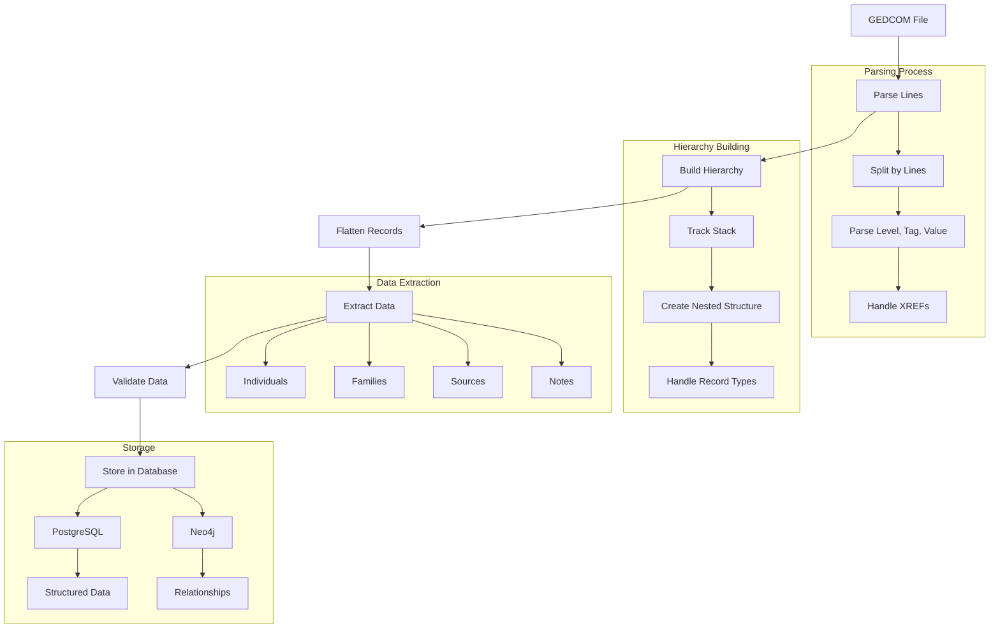
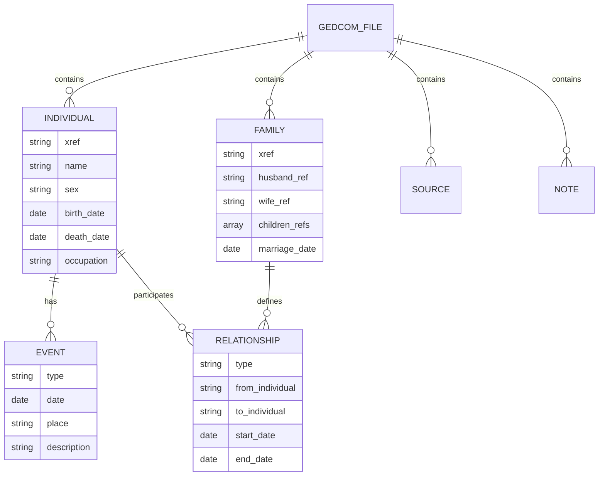

# GEDCOM Parsing Implementation Guide

This document describes a robust, extensible approach to parsing GEDCOM files for the LEG genealogy platform. It includes step-by-step explanations, code examples, and extensibility notes for future contributors.

---

## Overview

- **Goal:** Import GEDCOM files into LEG, mapping individuals, families, events, sources, and notes to the application's data model (PostgreSQL + Neo4j).
- **Approach:**
  - Parse GEDCOM line-by-line, building a hierarchical array structure.
  - Flatten the hierarchy into structured arrays for each record type.
  - Extract and map all standard tags (and easily extend for more).
  - **Note:** Handling of sources and notes is planned for future implementation. The parser structure supports it, but import logic does not yet process or link sources/notes.

## GEDCOM Parsing Flow



## Data Structure Mapping



---

## Step 1: Parse GEDCOM Lines and Build Hierarchy

**How it works:**
- Each line is parsed into: `level`, `xref` (optional), `tag`, `value` (optional).
- A stack tracks the current position in the hierarchy.
- Level 0 starts a new record (INDI, FAM, SOUR, NOTE, etc.).
- Nested tags (e.g., BIRT/DATE/PLAC) are stored as children.

**Code Example:**
```php
public function parse(string $gedcomContent): array
{
    $lines = preg_split('/\r\n|\r|\n/', $gedcomContent);
    $stack = [];
    $current = [];
    $records = [];
    $xrefMap = [];

    foreach ($lines as $line) {
        if (trim($line) === '') continue;
        // Parse: <level> <xref?> <tag> <value?>
        if (!preg_match('/^(\\d+)\\s+(@[^@]+@\\s+)?(\\w+)(?:\\s+(.*))?$/', $line, $matches)) continue;
        [, $level, $xref, $tag, $value] = array_pad($matches, 5, null);
        $level = (int)$level;
        $xref = trim($xref ?? '');
        $tag = strtoupper($tag);
        $value = $value ?? '';

        // Pop stack to current level
        while (count($stack) > $level) array_pop($stack);

        // New record (level 0)
        if ($level === 0) {
            if (in_array($tag, ['INDI', 'FAM', 'SOUR', 'NOTE'])) {
                $current = [
                    'type' => $tag,
                    'xref' => $xref,
                    'data' => [],
                ];
                $records[] = &$current;
                if ($xref) $xrefMap[$xref] = &$current;
                $stack = [&$current['data']];
            } else {
                // Header, TRLR, or unknown
                $current = [];
                $stack = [];
            }
            continue;
        }

        // Build nested structure
        $parent = &$stack[count($stack) - 1];
        if (!isset($parent[$tag])) {
            $parent[$tag] = [];
        }
        $entry = [
            'value' => $value,
            'xref' => $xref,
            'children' => [],
        ];
        $parent[$tag][] = &$entry;
        $stack[] = &$entry['children'];
        unset($entry);
    }
    // ...
```

---

## Step 2: Flatten Hierarchy to Structured Arrays

**How it works:**
- For each record, call a "flatten" method to extract relevant fields and relationships.
- These methods handle standard tags and can be extended for more.
- **Note:** Sources and notes are parsed and available in the returned arrays, but are not yet imported or linked in the database. This is planned for future implementation.

**Code Example:**
```php
$individuals = [];
$families = [];
$sources = [];
$notes = [];

foreach ($records as $rec) {
    switch ($rec['type']) {
        case 'INDI':
            $individuals[$rec['xref']] = $this->flattenIndividual($rec['data'], $rec['xref']);
            break;
        case 'FAM':
            $families[$rec['xref']] = $this->flattenFamily($rec['data'], $rec['xref']);
            break;
        case 'SOUR':
            $sources[$rec['xref']] = $this->flattenSource($rec['data'], $rec['xref']);
            break;
        case 'NOTE':
            $notes[$rec['xref']] = $this->flattenNote($rec['data'], $rec['xref']);
            break;
    }
}

return [
    'individuals' => $individuals,
    'families' => $families,
    'sources' => $sources,
    'notes' => $notes,
];
```

---

## Step 3: Flattening Methods for Each Record Type

**How it works:**
- Extract the most important fields from the nested arrays for each record type.
- Easily extendable for more tags.
- **Note:** The flattening methods for sources and notes are present, but their use in import logic is deferred to a future release.

**Code Example:**
```php
private function flattenIndividual(array $data, string $xref): array
{
    return [
        'xref' => $xref,
        'name' => $this->extractTagValue($data, 'NAME'),
        'sex' => $this->extractTagValue($data, 'SEX'),
        'birth' => $this->extractEvent($data, 'BIRT'),
        'death' => $this->extractEvent($data, 'DEAT'),
        'occupation' => $this->extractTagValue($data, 'OCCU'),
        'notes' => $this->extractNotes($data),
        'fams' => $this->extractRefs($data, 'FAMS'),
        'famc' => $this->extractRefs($data, 'FAMC'),
        // Add more as needed
    ];
}

private function flattenFamily(array $data, string $xref): array
{
    return [
        'xref' => $xref,
        'husb' => $this->extractRef($data, 'HUSB'),
        'wife' => $this->extractRef($data, 'WIFE'),
        'chil' => $this->extractRefs($data, 'CHIL'),
        'marriage' => $this->extractEvent($data, 'MARR'),
        'divorce' => $this->extractEvent($data, 'DIV'),
        'notes' => $this->extractNotes($data),
    ];
}

private function flattenSource(array $data, string $xref): array
{
    return [
        'xref' => $xref,
        'title' => $this->extractTagValue($data, 'TITL'),
        'author' => $this->extractTagValue($data, 'AUTH'),
        // Add more as needed
    ];
}

private function flattenNote(array $data, string $xref): array
{
    return [
        'xref' => $xref,
        'text' => $this->extractTagValue($data, 'CONC') . $this->extractTagValue($data, 'CONT'),
    ];
}
```

---

## Step 4: Utility Extraction Methods

**How it works:**
- Reusable helpers to extract values, references, and events from the nested arrays.

**Code Example:**
```php
private function extractTagValue(array $data, string $tag): ?string
{
    if (!isset($data[$tag][0]['value'])) return null;
    return $data[$tag][0]['value'];
}

private function extractRef(array $data, string $tag): ?string
{
    if (!isset($data[$tag][0]['value'])) return null;
    return $data[$tag][0]['value'];
}

private function extractRefs(array $data, string $tag): array
{
    if (!isset($data[$tag])) return [];
    return array_map(fn($item) => $item['value'], $data[$tag]);
}

private function extractEvent(array $data, string $eventTag): ?array
{
    if (!isset($data[$eventTag][0]['children'])) return null;
    $event = [];
    foreach ($data[$eventTag][0]['children'] as $tag => $entries) {
        foreach ($entries as $entry) {
            $event[strtolower($tag)] = $entry['value'];
        }
    }
    return $event;
}

private function extractNotes(array $data): array
{
    if (!isset($data['NOTE'])) return [];
    return array_map(fn($item) => $item['value'], $data['NOTE']);
}
```

---

## Step 5: Testing, Extension, and Usage

- **Test** with real GEDCOM files (various sources, edge cases).
- **Extend** flatten methods to support more tags as needed (e.g., `ALIA`, `NICK`, `RESI`, etc.).
- **Use** the returned arrays in `importToDatabase` to create/update your models and relationships.
- **Note:** Handling of sources and notes in the import process is a future enhancement. Contributors are encouraged to extend the import logic to support these features.

---

## Supported Tags (Summary Table)

| Record Type | Supported Tags (default)                | Extensible? | Import Logic |
|-------------|------------------------------------------|-------------|--------------|
| INDI        | NAME, SEX, BIRT, DEAT, OCCU, FAMS, FAMC | Yes         | Yes          |
| FAM         | HUSB, WIFE, CHIL, MARR, DIV, NOTE       | Yes         | Yes          |
| SOUR        | TITL, AUTH                              | Yes         | **Future**   |
| NOTE        | CONC, CONT                              | Yes         | **Future**   |

---

## Extensibility Notes

- To support more tags, add logic in the flatten methods.
- For custom tags, add new cases in the flatteners or utility methods.
- The parser is robust to unknown tags and can be extended for future GEDCOM versions.
- **Sources and notes are parsed and available for future linking and import.**

---

## References
- [GEDCOM 5.5.1 Standard](https://chronoplexsoftware.com/gedcom/gedcom-5.5.1.pdf)
- [FamilySearch GEDCOM Docs](https://www.familysearch.org/developers/docs/gedcom)

---

*This document is intended for LEG contributors and should be updated as the parser evolves.* 