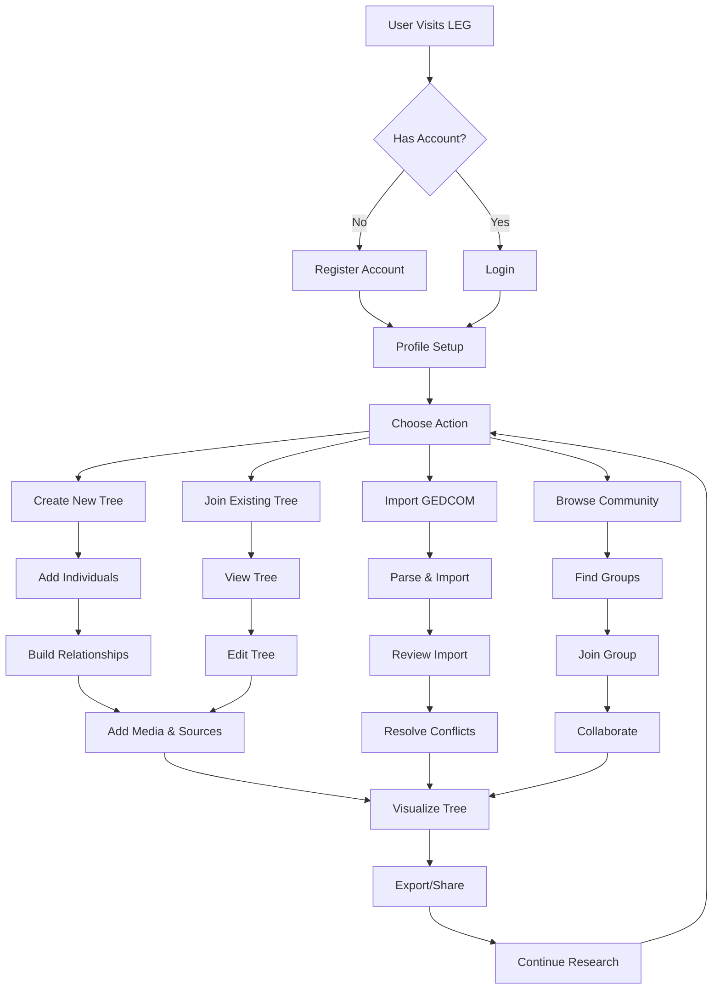
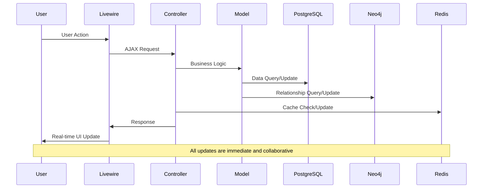

# User Flow

## Main User Journeys & Rationale

### 1. Onboarding & Account Management
- **Registration/Login:** User creates an account or logs in with secure credentials.
- **Profile Setup:** User sets up profile, preferences, and notification settings.
- **Edge Cases:** Password reset, email verification, and account deletion.
- **Value:** Lowers barrier to entry, personalizes experience, and supports secure collaboration.

### 2. Tree Creation & Management
- **Create New Tree:** User starts a new family tree (manual entry or GEDCOM import).
- **Add/Edit Individuals:** Add, edit, or remove individuals, partners, children, and parents.
- **Tree Visualization:** Visualize and interact with the tree (zoom, pan, switch layouts).
- **Edge Cases:** Duplicate detection, merge trees, undo/redo actions.
- **Value:** Empowers users to build and maintain accurate, rich family trees.

### 3. Individual & Group Management
- **View/Edit Individuals:** Access detailed profiles, timelines, and relationships.
- **Group Management:** Create and manage groups, assign members, and set permissions.
- **Edge Cases:** Orphaned individuals, group membership changes, privacy settings.
- **Value:** Supports collaboration, organization, and granular access control.

### 4. Media & Source Management
- **Upload Media:** Attach photos, documents, and media to individuals or events.
- **Source Citation:** Add and manage sources for facts and relationships.
- **Edge Cases:** File type/size validation, duplicate media, missing sources.
- **Value:** Enriches family stories and promotes research integrity.

### 5. Search & Navigation
- **Advanced Search:** Find individuals, groups, or events by name, date, or attribute.
- **Navigation:** Move between tree view, lists, and search results.
- **Edge Cases:** No results found, ambiguous queries, search within groups.
- **Value:** Increases usability and data discoverability.

### 6. Community & Collaboration
- **Join/Create Groups:** Users join or create groups for shared research.
- **Discussion & Forums:** Participate in group discussions (future feature).
- **Share Trees:** Invite collaborators or share view-only links.
- **Edge Cases:** Invitation management, group privacy, moderation.
- **Value:** Fosters community, knowledge sharing, and collaborative research.

### 7. Export & Reporting
- **Export Tree:** Download tree as image, PDF, or shareable link.
- **Printable Reports:** Generate and print detailed reports for individuals or families.
- **Edge Cases:** Large tree exports, custom report templates, export errors.
- **Value:** Supports offline sharing, documentation, and research output.

## User Journey Flow

## Data Flow & Real-Time Updates

## How Flows Support Platform Goals
- **Engagement:** Intuitive flows and real-time feedback keep users active and invested.
- **Collaboration:** Group and sharing flows enable collective research and community building.
- **Data Integrity:** Validation, source management, and activity logs ensure high-quality, trustworthy data.
- **Extensibility:** Modular flows allow for easy addition of new features and user journeys as the platform evolves. 